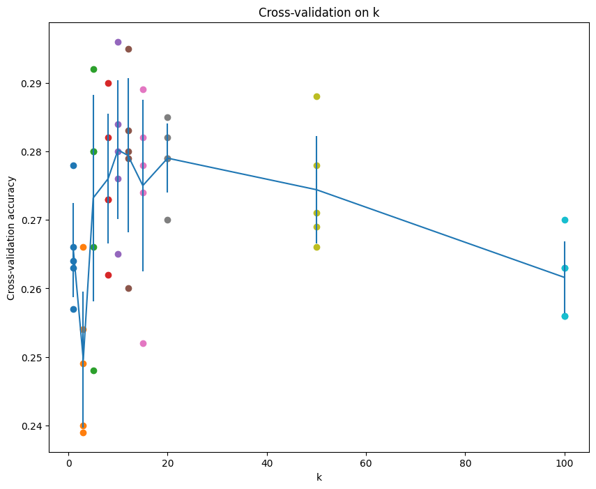
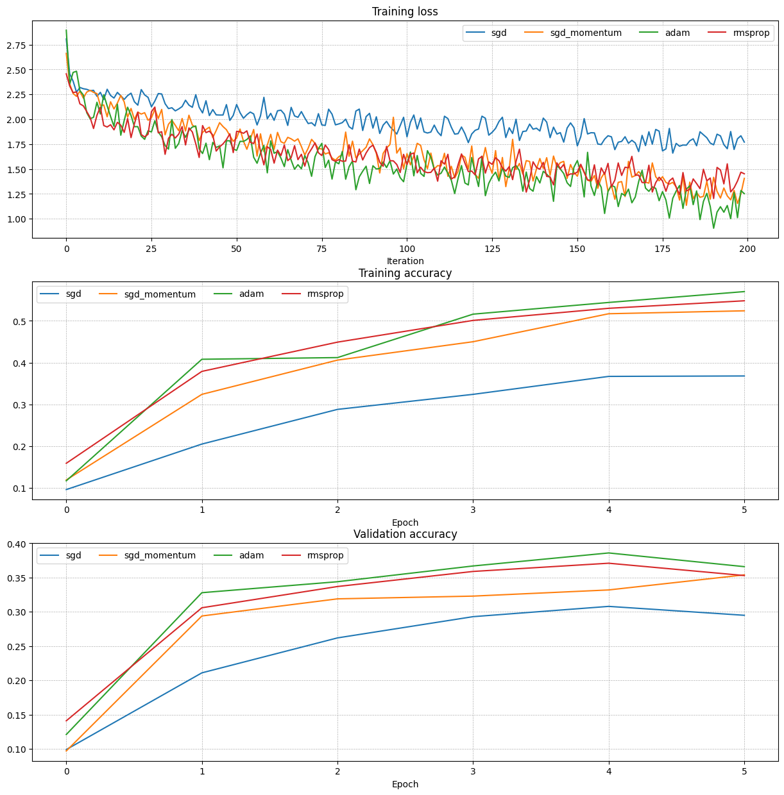
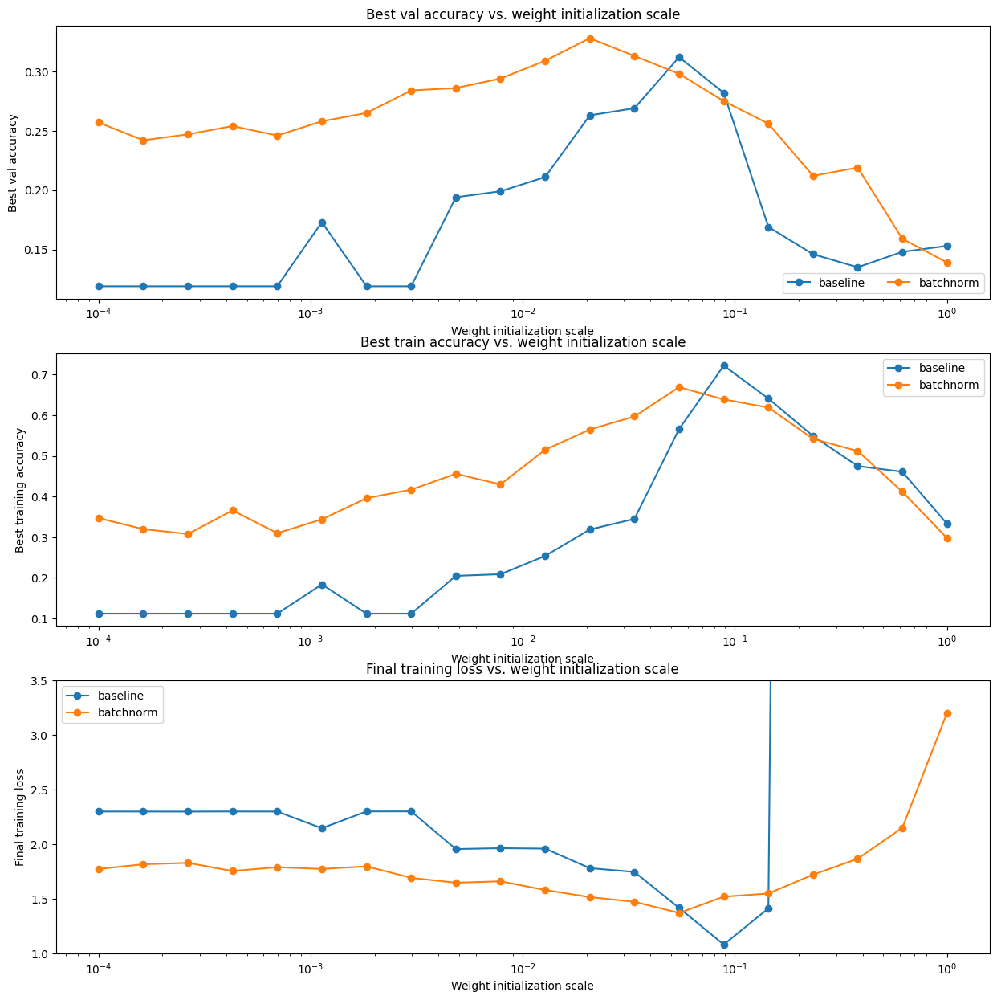
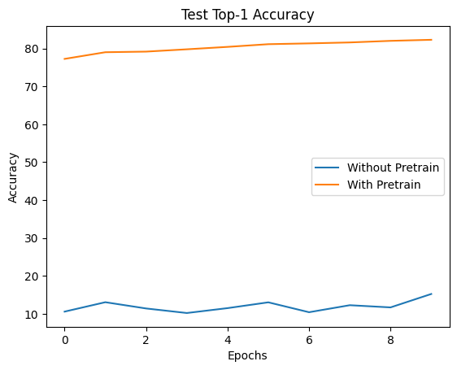
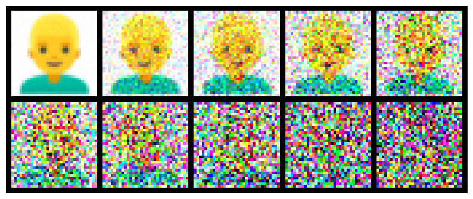
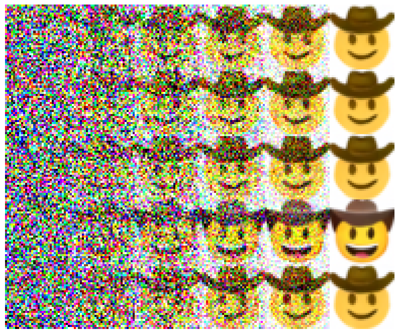
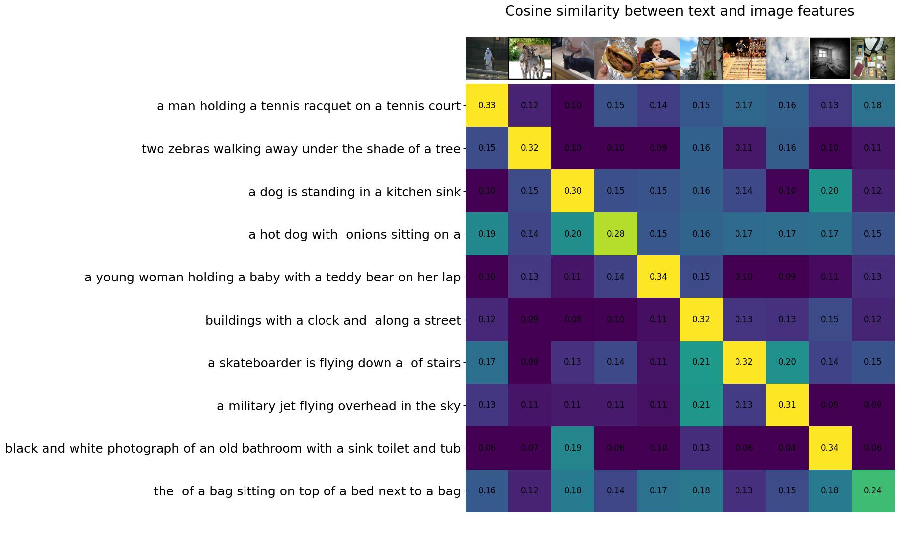
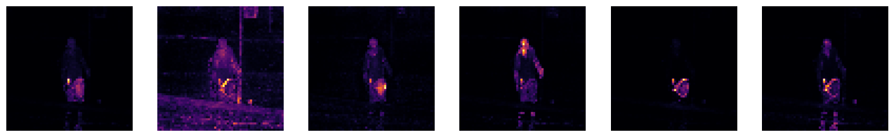
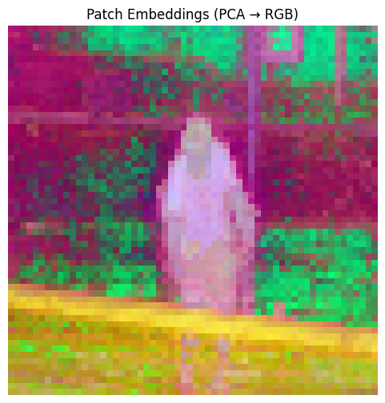

# CS231n: Deep Learning for Computer Vision

## Solutions and learning notes - Spring 2026

My implementations and experiment notes for [Stanford CS231n](https://cs231n.stanford.edu/). The assignments start with image classification in NumPy, build up to neural networks and sequence models, and then explore self-supervised learning and image generation in PyTorch.

The notes below explain the main ideas behind each exercise. Results and figures come from the notebooks in this repository; each question links to its implementation and experiments.

| Assignment | Topics | Course materials |
| --- | --- | --- |
| 1 | Nearest neighbors, softmax, fully connected networks, optimization | [Assignment 1](https://cs231n.github.io/assignments2026/assignment1/) |
| 2 | Normalization, dropout, convolutional networks, image captioning | [Assignment 2](https://cs231n.github.io/assignments2026/assignment2/) |
| 3 | Transformers, SimCLR, diffusion models, CLIP and DINO | [Assignment 3](https://cs231n.github.io/assignments2026/assignment3/) |

## Clone this repository

Repository: [JiangShiYu6/cs231n-2026](https://github.com/JiangShiYu6/cs231n-2026)

With Git installed, run these commands to download the assignment code and notebooks:

```bash
git clone https://github.com/JiangShiYu6/cs231n-2026.git
cd cs231n-2026
```

## Contents

- [Assignment 1: Classification fundamentals](#assignment-1-classification-fundamentals)
- [Assignment 2: Neural networks for vision](#assignment-2-neural-networks-for-vision)
- [Assignment 3: Representation learning and generation](#assignment-3-representation-learning-and-generation)
- [References](#references)

## Assignment 1: Classification fundamentals

### Q1: k-nearest neighbors

[Notebook](assignment1/knn.ipynb)

A k-nearest neighbor classifier stores the training examples. For each test image, it finds the closest training images and predicts the most frequent class among the nearest $k$ examples. There are no learned weights, so most of the work happens during prediction.

The main implementation exercise is computing Euclidean distances efficiently. Expanding the squared distance gives

$$
\|x-y\|_2^2 = \|x\|_2^2 + \|y\|_2^2 - 2x^\top y.
$$

This turns a pair of Python loops into a matrix multiplication and two broadcasted sums:

```python
squared_distances = (
    np.sum(X_test ** 2, axis=1, keepdims=True)
    + np.sum(X_train ** 2, axis=1)[None, :]
    - 2 * X_test @ X_train.T
)
distances = np.sqrt(np.maximum(squared_distances, 0))
```

The clipping protects the square root from tiny negative values caused by floating-point arithmetic. Cross-validation selects $k$: small values can be sensitive to individual examples, while larger values smooth the decision boundary.



### Q2: Softmax classification

[Notebook](assignment1/softmax.ipynb)

A linear classifier maps an image vector to class scores, $s=xW+b$. Softmax converts these scores into probabilities, and cross-entropy penalizes assigning a low probability to the correct class:

$$
p_j = \frac{\exp(s_j)}{\sum_c \exp(s_c)},
\qquad
\mathcal{L} = -\log p_y.
$$

Subtracting the largest score before exponentiation leaves the probabilities unchanged and prevents overflow. The exercise implements the loss and its gradients in both loop-based and vectorized forms, then uses numerical gradient checks to compare them.

The raw-pixel softmax classifier reaches 36.30% test accuracy on CIFAR-10. Its linear decision boundaries provide a useful baseline for the nonlinear models that follow.

### Q3: Two-layer neural network

[Notebook](assignment1/two_layer_net.ipynb)

Adding a hidden layer with ReLU allows the network to learn nonlinear features:

$$
h = \max(0, xW_1+b_1),
\qquad
s = hW_2+b_2.
$$

The backward pass applies the chain rule through the softmax loss, output layer and ReLU. Learning rate and regularization are selected using validation accuracy. Watching both training and validation curves helps distinguish insufficient fitting from overfitting.

The selected model reaches 51.50% validation accuracy and 50.10% test accuracy.

### Q4: Image features

[Notebook](assignment1/features.ipynb)

This exercise replaces raw pixels with histogram of oriented gradients (HOG) and color histogram features. HOG summarizes local edge directions; color histograms describe the distribution of colors without preserving their exact positions.

These features give the classifier information that would otherwise need to be learned from pixels. In the saved experiments, the linear classifier reaches 51.40% validation accuracy, and a neural network on the extracted features reaches 61.70%.

### Q5: Fully connected networks and optimization

[Notebook](assignment1/FullyConnectedNets.ipynb)

Reusable affine and activation layers make it possible to build networks with arbitrary depth. The experiments first overfit a small training subset, which is a practical way to check whether forward propagation, gradients and parameter updates work together.

The optimizer comparison examines how updates use gradient history:

| Optimizer | Update idea |
| --- | --- |
| SGD | Move against the current minibatch gradient. |
| Momentum | Accumulate a moving direction to reduce oscillation. |
| RMSProp | Scale each update using a moving average of squared gradients. |
| Adam | Combine first- and second-moment estimates with bias correction. |



The selected fully connected model reaches 54.90% validation accuracy and 52.00% test accuracy. These results belong to the configurations explored in the notebook; increasing depth alone does not guarantee better performance.

## Assignment 2: Neural networks for vision

### Q1: Batch normalization and layer normalization

[Notebook](assignment2/BatchNormalization.ipynb)

Normalization controls the scale of intermediate activations. Batch normalization normalizes each feature using minibatch statistics during training and running statistics during inference. Layer normalization computes statistics across the features of each example, so its normalization does not depend on the other examples in the batch.

Both methods use learned scale and shift parameters:

$$
\hat{x} = \frac{x-\mu}{\sqrt{\sigma^2+\epsilon}},
\qquad
y = \gamma\hat{x}+\beta.
$$

The experiments vary initialization scale and batch size to examine their effect on optimization.



### Q2: Dropout

[Notebook](assignment2/Dropout.ipynb)

Dropout randomly removes activations during training, reducing reliance on particular hidden units. With keep probability $p$, inverted dropout uses

$$
\tilde{h} = \frac{m\odot h}{p},
\qquad m_i\sim\mathrm{Bernoulli}(p).
$$

Dividing by $p$ preserves the expected activation. At inference, dropout is disabled and the full network is used. The notebook compares training and validation accuracy at different keep probabilities to study the trade-off between regularization and fitting the training set.

### Q3: Convolutional networks

[Notebook](assignment2/ConvolutionalNetworks.ipynb)

Convolution applies the same learned filters across spatial locations. Local connections and shared weights make this a useful architecture for images: a feature detector can respond to an edge or texture wherever it appears.

The implementation includes convolution and max-pooling forward and backward passes, followed by a small convolutional classifier. During backpropagation, gradients from overlapping receptive fields must accumulate; max-pooling routes gradients to the selected maximum in each pooling region.

### Q4: Image classification with PyTorch

[Notebook](assignment2/PyTorch.ipynb)

This notebook moves from manually implemented layers to PyTorch autograd, `nn.Module` and `nn.Sequential`. The training loop combines minibatch loading, forward prediction, cross-entropy loss, backpropagation and optimizer updates.

| Experiment | Saved result |
| --- | --- |
| Three-layer CNN with `nn.Module` | 47.70% validation accuracy after one epoch |
| Three-layer CNN with `nn.Sequential` | 58.60% validation accuracy after one epoch |
| CIFAR-10 challenge model | 88.60% best validation accuracy |
| CIFAR-10 challenge model | 88.06% test accuracy |

Validation performance guides model selection. The separate test result measures the selected model on examples outside that selection process.

### Q5: Image captioning with a vanilla RNN

[Notebook](assignment2/RNN_Captioning_pytorch.ipynb)

Image features initialize the recurrent model, and word embeddings turn token indices into vectors. At each step, the RNN combines the previous hidden state with the current word embedding to predict the next token.

Training uses the ground-truth previous word, often called teacher forcing. During generation, the model feeds back its own prediction. A temporal mask prevents padding tokens from contributing to the loss.

The small-data overfitting experiment reaches a loss of approximately 0.01337, showing that the model can learn the limited set of training captions. Generated caption examples are saved in the notebook.

## Assignment 3: Representation learning and generation

### Q1: Image captioning with Transformers

[Notebook](assignment3/Transformer_Captioning.ipynb)

Attention lets each token combine information from other tokens according to learned similarity scores:

$$
\mathrm{Attention}(Q,K,V)
=\mathrm{softmax}\left(\frac{QK^\top}{\sqrt{d_k}}\right)V.
$$

The captioning decoder uses causal self-attention so a word cannot see future words during training. Cross-attention supplies information from the image, while positional encodings represent token order. Multiple attention heads learn different ways of combining the available context.

#### Vision Transformer

The classification part divides an image into patches and projects each patch into a token vector. Positional encodings are added before the Transformer encoder. Averaging the output patch vectors produces one image representation, which a linear layer maps to class logits.

```text
Image -> Patch embeddings -> Positional encodings
      -> Transformer encoder -> Mean pooling -> Class logits
```

The ViT experiment reaches 46.72% CIFAR-10 test accuracy after two epochs. Unlike convolutional networks, a basic ViT has fewer built-in assumptions about local image structure, which helps explain why learning from a small dataset can be demanding.

### Q2: Self-supervised learning with SimCLR

[Notebook](assignment3/Self_Supervised_Learning.ipynb)

SimCLR creates two independently augmented views of each image. Both pass through a shared encoder $f$ and projection head $g$:

$$
h_i=f(\tilde{x}_i),\qquad z_i=g(h_i).
$$

The contrastive objective makes views of the same image similar in projection space while distinguishing views from different images. For a positive pair $(i,j)$ among $2N$ augmented samples,

$$
\ell_{i,j}=-\log
\frac{\exp(\mathrm{sim}(z_i,z_j)/\tau)}
{\sum_{k\ne i}\exp(\mathrm{sim}(z_i,z_k)/\tau)}.
$$

Here, $\mathrm{sim}$ is cosine similarity and $\tau$ is the temperature. The denominator includes the positive partner and excludes the anchor itself. The final loss averages both directions of every positive pair.

The projection head is used for the contrastive objective; the encoder representation is used for downstream classification. This lets the representation before the head retain information useful beyond matching augmented views.

| Downstream classification | Best top-1 accuracy |
| --- | --- |
| Without self-supervised pretraining | 15.24% |
| With self-supervised pretraining | 82.28% |



The comparison illustrates how pretraining can provide useful visual features before learning from the labeled subset.

### Q3: Denoising diffusion probabilistic models

[Notebook](assignment3/DDPM.ipynb)

#### Forward diffusion

The forward process gradually corrupts an image with Gaussian noise. It can sample any timestep directly, without computing every intermediate image:

$$
x_t=\sqrt{\bar\alpha_t}\,x_0+
\sqrt{1-\bar\alpha_t}\,\epsilon,
\qquad \epsilon\sim\mathcal{N}(0,I).
$$

Here, $\alpha_t=1-\beta_t$ and $\bar\alpha_t=\prod_{s=1}^{t}\alpha_s$. As $\bar\alpha_t$ decreases, the image signal fades and noise becomes dominant.



#### Reverse diffusion and the UNet

Generation starts from Gaussian noise and repeatedly predicts a less noisy image. The UNet receives the current image together with timestep and text information. Its encoder collects features at decreasing spatial resolutions, and skip connections bring spatial detail back into the decoder.

The exercises implement both noise prediction and clean-image prediction, together with the conversions between them. A weighted denoising loss trains the model, and the reverse sampler uses its prediction to estimate the next denoising step.

#### Classifier-free guidance

Classifier-free guidance combines a conditional prediction with an unconditional prediction:

$$
\hat\epsilon=(1+w)\epsilon_\theta(x_t,t,c)
-w\epsilon_\theta(x_t,t,\varnothing).
$$

The guidance scale $w$ strengthens the influence of the text condition. Higher guidance can improve adherence to the prompt, with a possible reduction in sample diversity.

The notebook uses the course checkpoint trained for 70,000 steps to generate emoji images. The example below shows guided sampling for "face with cowboy hat."



### Q4: CLIP and DINO

[Notebook](assignment3/CLIP_DINO.ipynb)

#### CLIP: Connecting images and language

CLIP embeds images and text into a shared space. After normalizing the feature vectors, their dot product measures cosine similarity. An entire image-text similarity table can therefore be computed with one matrix multiplication.



For zero-shot classification, class descriptions act as text queries, and the most similar description determines the prediction. For text-to-image retrieval, a query is compared with cached image features, so the image encoder does not need to run again for each search.

#### DINO: Visual features without class labels

DINO learns representations through a teacher-student self-distillation objective. In this assignment, a pretrained DINO model supplies attention maps and patch embeddings. The attention visualization helps show which image regions the model emphasizes.



Projecting patch embeddings onto three principal components gives a color visualization of their structure. Similar colors indicate similar coordinates in this projection; the colors themselves are not semantic class labels.



A linear segmentation head is trained on the labeled patches of frame 40 from the DAVIS `soapbox` video, then applied to the other frames. The encoder features stay fixed, so this experiment tests how well a simple classifier can use the pretrained representation.

| Evaluation | Mean IoU |
| --- | --- |
| First frame | 0.464 |
| Last frame | 0.532 |
| All 99 frames | 0.625 |

The head is trained for 500 steps with Adam, using class-weighted cross-entropy and weight decay. The all-frame score includes the annotated training frame and describes performance on this same video.

## References

- [Stanford CS231n course](https://cs231n.stanford.edu/)
- [CS231n course notes and assignments](https://cs231n.github.io/)
- [YYZhang2025/Stanford-CS231N](https://github.com/YYZhang2025/Stanford-CS231N), the inspiration for organizing this README by assignment and question.
